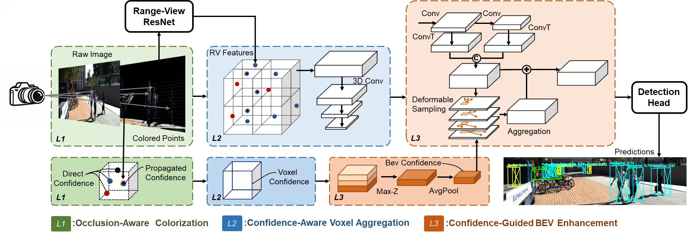

# HC-MVMM

**HC-MVMM: Hierarchical Confidence-Guided Multi-View Multi-Modal 3-D Object
Detection** is the official implementation of the BMVC 2026 paper of the
same title. The detector improves the MVMM LiDAR-camera baseline with a
hierarchical reliability trace propagated from point-level colorization to
voxel-level reliability and BEV-level confidence-guided enhancement.

This repository contains only the code needed to reproduce the final
**L1 + L2 + L3** model reported in Table 2 of the paper.

## Architecture

<p align="center">
  
</p>

<p align="center"><sub>
Overview of HC-MVMM. <b>L1</b> performs occlusion-aware point colorization
with direct and propagated confidences; <b>L2</b> aggregates the coloured
points and range-view features into voxel features and a voxel confidence;
<b>L3</b> collapses the voxel confidence into a BEV confidence map that
calibrates a deformable BEV aggregation. The enhanced BEV feature is added
back through a residual connection before being sent to the CenterPoint
detection head.
</sub></p>

## Qualitative results

<p align="center">
  
</p>

<p align="center"><sub>
3-D detection results of HC-MVMM on the KITTI test set. For each scene the
top row shows projected 3-D boxes on the RGB image and the bottom row shows
the corresponding coloured point-cloud view. Pedestrian, Cyclist and Car are
coloured in cyan, yellow and green, respectively. The scenes include crowded
traffic, occlusion and sparse distant observations.
</sub></p>

## Results on the KITTI test set

3-D AP_R40 reported by the [official KITTI test server][kitti-eval]:

| Class      | Easy  | Moderate | Hard  |
|------------|-------|----------|-------|
| Car        | 87.40 | 79.25    | 74.82 |
| Pedestrian | 51.23 | 45.08    | 42.88 |
| Cyclist    | 81.74 | 67.89    | 61.86 |

[kitti-eval]: https://www.cvlibs.net/datasets/kitti/eval_object_detail.php?&result=1b13a31716d670e536ca6ef0ff8b990f23e99547

## Repository layout

```
HC-MVMM/
├── configs/
│   └── hc_mvmm.yaml           # Final L1+L2+L3 configuration
├── data/
│   ├── kitti_dataset.py
│   ├── occlusion_aware_colorizer.py   # L1
│   └── kitti_object_eval_python/      # Official KITTI eval (vendored)
├── layers/
│   ├── rv_backbones/res_net.py
│   ├── pv_bridges/voxel_feature_extractor.py   # L2
│   ├── bev_backbones/{base_bev_backbone, enhanced_bev_backbone}.py  # L3
│   └── heads/centerpoint_head.py
├── helpers/                   # Trainer / Tester / dataloader / optimizer
├── utils/                     # Geometry, augmentation, range-image helpers
├── ops/                       # CUDA extensions (iou3d_nms, roiaware_pool3d)
├── train.py
├── test.py
├── hc_mvmm.py
├── setup.py
└── requirements.txt
```

## Environment

The reference environment used to produce the results reported in the
paper is:

| Component       | Version                                |
|-----------------|----------------------------------------|
| Python          | 3.8.20                                 |
| OS              | Linux x86_64 (glibc 2.17 +)            |
| CUDA toolkit    | 11.3                                   |
| PyTorch         | 1.10.2+cu113                           |
| spconv          | spconv-cu113 == 2.3.6 (with cumm-cu113 0.4.11) |
| GPU             | NVIDIA RTX 4000 SFF Ada (or any 8 GB+ card) |

Other recent CUDA / PyTorch combinations should also work as long as the
matching ``spconv-cuXXX`` wheel exists.

```bash
conda create -n hcmvmm python=3.8 -y
conda activate hcmvmm

# 1. PyTorch matching the local CUDA toolkit (reference: CUDA 11.3).
pip install torch==1.10.2+cu113 --extra-index-url https://download.pytorch.org/whl/cu113

# 2. spconv wheel matching the same CUDA toolkit.
pip install spconv-cu113==2.3.6

# 3. The remaining Python dependencies.
pip install -r requirements.txt

# 4. Compile the two CUDA extensions in-place.
python setup.py develop
```

> Replace ``cu113`` with the CUDA tag that matches your driver (e.g.
> ``cu102``, ``cu117``, ``cu118``, ``cu121``) in both the torch and spconv
> install commands.

## Data

The detector follows the standard KITTI 3-D object-detection layout. From
the official KITTI website download the left-color images, Velodyne point
clouds, calibration files, training labels, and the road planes used by GT
sampling. Place them under ``data/kitti`` as follows:

```
data/kitti/
├── ImageSets/{train,val,trainval,test}.txt
├── training/
│   ├── image_2/
│   ├── velodyne/
│   ├── calib/
│   ├── label_2/
│   └── planes/
└── testing/
    ├── image_2/
    ├── velodyne/
    └── calib/
```

Build the info pickles and the GT-sampling database:

```bash
python -m data.kitti_dataset create_kitti_infos
```

## Training

```bash
python train.py --cfg_file configs/hc_mvmm.yaml
```

Useful overrides:

* ``--batch_size N``: replace the YAML batch size with ``N``.
* ``--epochs N``: shorten the schedule for debugging runs.
* ``--resume_checkpoint path/to/ckpt.pth``: resume from a saved checkpoint.

Logs (TensorBoardX + text) are written to ``logs/`` and checkpoints to
``checkpoints/`` by default.

## Evaluation

```bash
python test.py --cfg_file configs/hc_mvmm.yaml \
               --checkpoint checkpoints/checkpoint_epoch_80.pth \
               --result_dir outputs/data
```

The validation split prints the official KITTI AP_R40 table for the three
categories. For the official KITTI test server submission, set
``tester.split: 'test'`` (or pass ``--split test`` by editing the YAML)
and submit the contents of ``outputs/data``.

## Acknowledgements

This work builds on top of [MVMM](https://github.com/shangjie-li/mvmm),
which itself derives from [OpenPCDet](https://github.com/open-mmlab/OpenPCDet).

> S. Li, K. Geng, G. Yin, Z. Wang, M. Qian. *MVMM: Multi-view multimodal
> 3-D object detection for autonomous driving.* IEEE TII, 2024.
